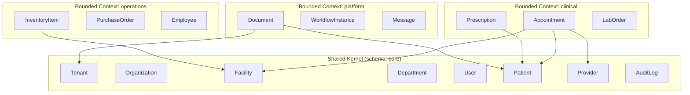
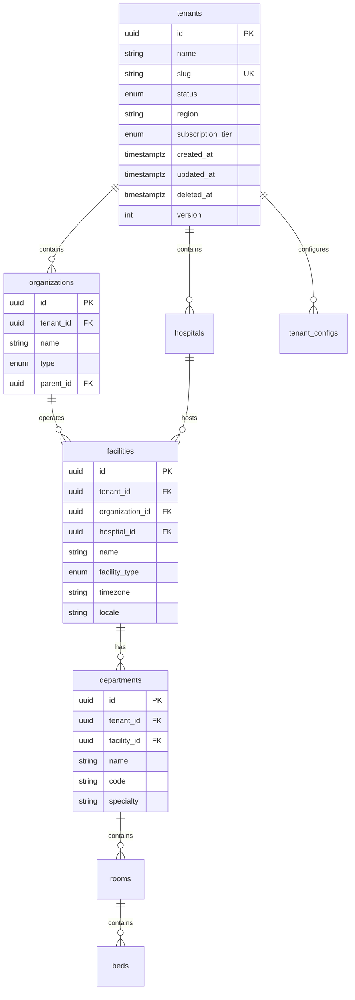
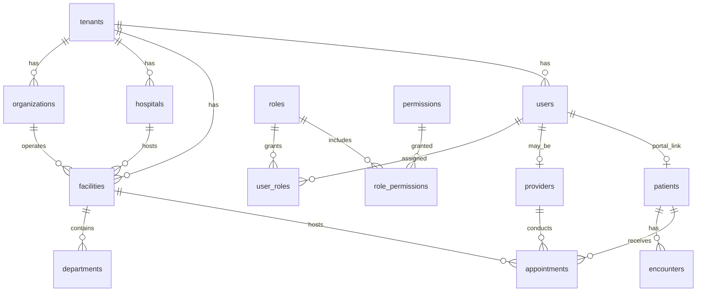
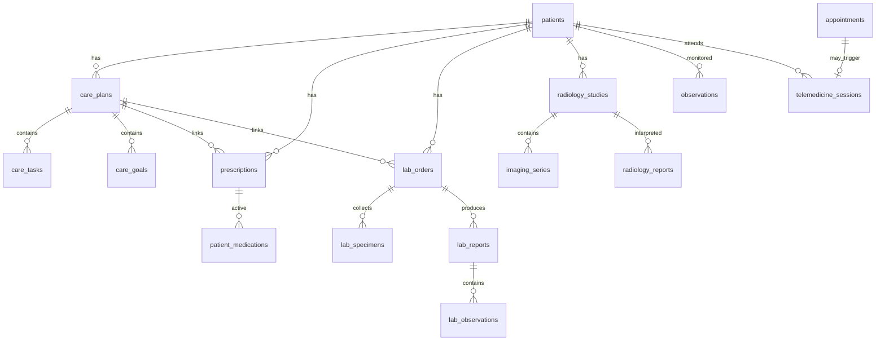
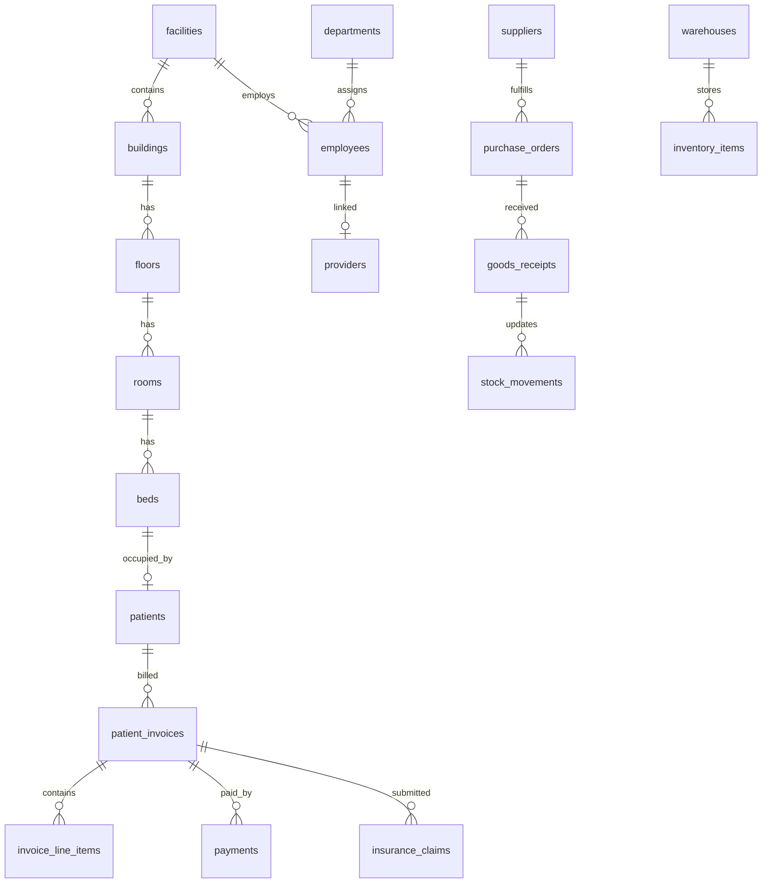
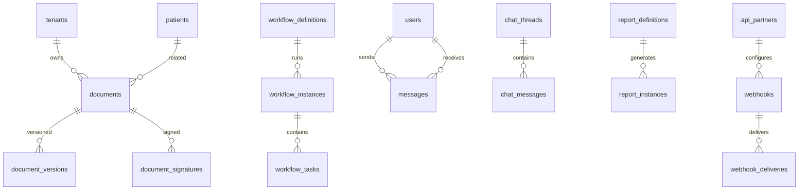

# Document 08.2 — Enterprise Data Model & Prisma Foundation

**Med-ease Enterprise Healthcare Platform**  
**Phase:** 08.2 — Enterprise Data Model & Prisma Foundation  
**Status:** Canonical data architecture (implementation-ready)  
**Prerequisite:** [Document 08.1 — Backend Foundation & Architecture](./08.1-backend-foundation-architecture.md)  
**Audience:** Backend engineers, database architects, security/compliance reviewers

---

## Executive Summary

This document is the **single source of truth** for Med-ease backend persistence. It defines every table, relationship, naming convention, tenancy rule, audit pattern, index, partition, migration approach, seed strategy, and FHIR identifier mapping **before any API endpoint or NestJS module is implemented**.

The data model is derived from the **frozen frontend** `types.ts` files across 29 repository modules in `artifacts/medease/src/services/`. Backend tables mirror frontend entity interfaces—not redesigned domain models.

**Design approach:** Domain-Driven Design (DDD) with a **Shared Kernel** (tenancy, identity, audit, patients, providers, facilities) and **Bounded Contexts** aligned to frontend modules. Cross-context references use UUID foreign keys; cross-context writes use domain events (Phase 08.4).

**At the end of Phase 08.2 implementation**, engineers will produce:

- `database/prisma/schema/` — multi-file Prisma schema
- `database/rls/` — PostgreSQL RLS policies
- `database/partitioning/` — partition DDL scripts
- `database/seeds/` — dev/demo seed mapped from frontend `mock-data.ts`

No REST endpoints. No NestJS controllers. Data layer only.

---

## Table of Contents

1. [Design Philosophy](#1-design-philosophy)
2. [Bounded Contexts & Schema Organization](#2-bounded-contexts--schema-organization)
3. [Shared Kernel](#3-shared-kernel)
4. [Global Conventions](#4-global-conventions)
5. [Complete Entity Catalog](#5-complete-entity-catalog)
6. [Entity Relationship Diagrams](#6-entity-relationship-diagrams)
7. [Relationship Strategy](#7-relationship-strategy)
8. [Multi-Tenant Implementation & RLS](#8-multi-tenant-implementation--rls)
9. [Audit Strategy](#9-audit-strategy)
10. [Soft Delete Strategy](#10-soft-delete-strategy)
11. [Optimistic Concurrency & Versioning](#11-optimistic-concurrency--versioning)
12. [UUID Strategy](#12-uuid-strategy)
13. [Indexing Strategy](#13-indexing-strategy)
14. [Partitioning Strategy](#14-partitioning-strategy)
15. [Prisma Schema Organization](#15-prisma-schema-organization)
16. [Migration Strategy](#16-migration-strategy)
17. [Seed Strategy](#17-seed-strategy)
18. [FHIR Identifier Mapping](#18-fhir-identifier-mapping)
19. [Performance Considerations](#19-performance-considerations)
20. [Entity-to-Frontend Module Matrix](#20-entity-to-frontend-module-matrix)
21. [Implementation Checklist](#21-implementation-checklist)

---

## 1. Design Philosophy

### 1.1 Frontend types are canonical

Every persisted entity maps to a frontend TypeScript interface. Column names use **snake_case** in PostgreSQL; Prisma maps to **camelCase** to match frontend field names where they exist.

| Rule                                                    | Example                                                                              |
| ------------------------------------------------------- | ------------------------------------------------------------------------------------ |
| Frontend `patientId` → DB `patient_id`                  | UUID FK                                                                              |
| Frontend `tenantId` → DB `tenant_id`                    | UUID FK, required on tenant-scoped tables                                            |
| Frontend nested objects → normalized tables             | `Appointment.patient` → `appointments.patient_id` FK                                 |
| Frontend embedded strings → FK or denormalized snapshot | `Encounter.facility` (string) → `facility_id` FK + optional `facility_name_snapshot` |

### 1.2 Shared Kernel vs module-specific entities



**Shared Kernel entities** are referenced by FK from all contexts. They are owned by `core` schema modules (platform-admin + iam + patient-records + facilities + workforce bridge).

**Bounded context entities** are owned by one context; other contexts reference via ID only (no cross-context JOINs in hot paths—use read models or events for denormalized views).

### 1.3 Aggregate roots

| Aggregate root        | Child entities                                   | Owner context              |
| --------------------- | ------------------------------------------------ | -------------------------- |
| `Patient`             | demographics, allergies, immunizations, coverage | clinical / patient-records |
| `PatientHealthRecord` | encounters, notes, timeline (read model)         | clinical / patient-records |
| `Appointment`         | time_slots, queue_entries, waitlist              | clinical / appointments    |
| `CarePlan`            | goals, tasks, team_members, risk_assessments     | clinical / care-plans      |
| `Prescription`        | doses, refill_requests, dispenses                | clinical / medications     |
| `LabOrder`            | specimens, observations, reports                 | clinical / laboratory      |
| `RadiologyStudy`      | series, instances, reports, annotations          | clinical / radiology       |
| `PatientInvoice`      | line_items, payments, claims                     | financial / billing        |
| `PurchaseOrder`       | line_items, receipts, shipments                  | operations / procurement   |
| `Document`            | versions, signatures, annotations                | platform / documents       |
| `WorkflowInstance`    | tasks, approvals, events                         | platform / workflows       |
| `Tenant`              | hospitals, facilities, licenses, feature_flags   | platform / platform-admin  |

---

## 2. Bounded Contexts & Schema Organization

PostgreSQL **schemas** (namespaces) enforce logical separation. Prisma uses `@@schema()` directive (Prisma 5.2+ multi-schema).

| PostgreSQL schema | Bounded context            | Frontend modules                                                                                     | ~Tables |
| ----------------- | -------------------------- | ---------------------------------------------------------------------------------------------------- | ------- |
| `core`            | Shared Kernel              | platform-admin, iam, patient-records (identity), facilities, workforce (bridge)                      | 25      |
| `clinical`        | Clinical Care              | appointments, care-plans, medications, laboratory, radiology, patient-monitoring, telemedicine, cdss | 85      |
| `operations`      | Hospital Operations        | inventory, procurement, workforce, facilities (physical), quality                                    | 55      |
| `financial`       | Revenue Cycle              | billing, finance                                                                                     | 30      |
| `population`      | Population & Public Health | population-health, public-health, research                                                           | 40      |
| `intelligence`    | Analytics & AI             | ai-intelligence, executive, cdss (read models)                                                       | 25      |
| `platform`        | Platform Services          | documents, workflows, messaging, reporting, api-platform                                             | 45      |
| `interop`         | Interoperability           | interoperability                                                                                     | 30      |
| `audit`           | Compliance                 | audit_logs, security_events (append-only)                                                            | 5       |

**Total: ~340 tables** (including junction, version, and audit child tables).

---

## 3. Shared Kernel

All Shared Kernel tables live in schema `core`. Every other schema references these via FK.

### 3.1 Tenancy hierarchy



### 3.2 Shared Kernel table definitions

#### `core.tenants`

| Column              | Type              | Constraints                     | Notes                                                 |
| ------------------- | ----------------- | ------------------------------- | ----------------------------------------------------- |
| `id`                | UUID              | PK, default `gen_random_uuid()` |                                                       |
| `name`              | VARCHAR(255)      | NOT NULL                        |                                                       |
| `slug`              | VARCHAR(100)      | NOT NULL, UNIQUE                | URL-safe                                              |
| `status`            | tenant_status     | NOT NULL, default `active`      | enum: active, suspended, provisioning, decommissioned |
| `region`            | VARCHAR(50)       | NOT NULL                        | Data residency                                        |
| `subscription_tier` | subscription_tier | NOT NULL                        | enum: starter, professional, enterprise               |
| `created_by`        | UUID              | FK → core.users                 | Platform admin                                        |
| `updated_by`        | UUID              | FK → core.users                 |                                                       |
| `created_at`        | TIMESTAMPTZ       | NOT NULL, default now()         |                                                       |
| `updated_at`        | TIMESTAMPTZ       | NOT NULL                        |                                                       |
| `deleted_at`        | TIMESTAMPTZ       | NULL                            | Soft delete                                           |
| `version`           | INT               | NOT NULL, default 1             | Optimistic lock                                       |

**Indexes:** `UNIQUE (slug) WHERE deleted_at IS NULL`, `(status, region)`

#### `core.organizations`

| Column          | Type         | Constraints              |
| --------------- | ------------ | ------------------------ |
| `id`            | UUID         | PK                       |
| `tenant_id`     | UUID         | NOT NULL, FK → tenants   |
| `name`          | VARCHAR(255) | NOT NULL                 |
| `type`          | org_type     | NOT NULL                 |
| `parent_id`     | UUID         | FK → organizations, NULL |
| + audit columns |              |                          |

**Indexes:** `(tenant_id, deleted_at)`, `(tenant_id, parent_id)`

#### `core.hospitals`

Maps frontend `platform-admin.Hospital`.

| Column          | Type         | Notes             |
| --------------- | ------------ | ----------------- |
| `id`            | UUID         | PK                |
| `tenant_id`     | UUID         | FK                |
| `name`          | VARCHAR(255) |                   |
| `code`          | VARCHAR(50)  | Unique per tenant |
| `bed_capacity`  | INT          |                   |
| + audit columns |              |                   |

#### `core.facilities`

Unified facility record merging `platform-admin.FacilityConfig` and `facilities.FacilitySite`.

| Column            | Type            | Notes                                               |
| ----------------- | --------------- | --------------------------------------------------- |
| `id`              | UUID            | PK — frontend `facilityId`                          |
| `tenant_id`       | UUID            | FK                                                  |
| `organization_id` | UUID            | FK, nullable                                        |
| `hospital_id`     | UUID            | FK, nullable                                        |
| `name`            | VARCHAR(255)    |                                                     |
| `code`            | VARCHAR(50)     |                                                     |
| `facility_type`   | facility_type   | hospital, clinic, pharmacy, lab, imaging, transport |
| `timezone`        | VARCHAR(50)     |                                                     |
| `locale`          | VARCHAR(10)     |                                                     |
| `enabled_modules` | JSONB           | Module flags per facility                           |
| `address`         | JSONB           | Structured address                                  |
| `status`          | facility_status |                                                     |
| + audit columns   |                 |                                                     |

**Indexes:** `(tenant_id, id)`, `(tenant_id, facility_type)`, `(hospital_id)`

#### `core.departments`

| Column             | Type         | Notes                               |
| ------------------ | ------------ | ----------------------------------- |
| `id`               | UUID         | PK                                  |
| `tenant_id`        | UUID         | FK                                  |
| `facility_id`      | UUID         | FK                                  |
| `name`             | VARCHAR(255) |                                     |
| `code`             | VARCHAR(50)  |                                     |
| `specialty`        | VARCHAR(100) |                                     |
| `head_employee_id` | UUID         | FK → operations.employees, nullable |
| + audit columns    |              |                                     |

#### `core.users`

Maps frontend `iam.IamUser`. Auth credentials live in Supabase; this table holds Med-ease profile + tenancy.

| Column             | Type         | Notes                                |
| ------------------ | ------------ | ------------------------------------ |
| `id`               | UUID         | PK — frontend `userId`               |
| `tenant_id`        | UUID         | FK                                   |
| `organization_id`  | UUID         | FK                                   |
| `facility_id`      | UUID         | FK, nullable (primary facility)      |
| `supabase_auth_id` | UUID         | UNIQUE, links to Supabase auth.users |
| `email`            | VARCHAR(255) | NOT NULL                             |
| `display_name`     | VARCHAR(255) |                                      |
| `status`           | user_status  | active, inactive, locked, pending    |
| `mfa_enabled`      | BOOLEAN      | default false                        |
| `last_login_at`    | TIMESTAMPTZ  |                                      |
| + audit columns    |              |                                      |

**Indexes:** `UNIQUE (tenant_id, email) WHERE deleted_at IS NULL`, `(supabase_auth_id)`

#### `core.patients`

Maps frontend `patient-records.PatientDemographics`. Central patient identity.

| Column                | Type         | Notes                                      |
| --------------------- | ------------ | ------------------------------------------ |
| `id`                  | UUID         | PK                                         |
| `tenant_id`           | UUID         | FK                                         |
| `user_id`             | UUID         | FK → users, nullable (patient portal link) |
| `mrn`                 | VARCHAR(50)  | NOT NULL, unique per tenant                |
| `national_id`         | VARCHAR(50)  | Encrypted column                           |
| `full_name`           | VARCHAR(255) |                                            |
| `date_of_birth`       | DATE         |                                            |
| `gender`              | gender       |                                            |
| `phone`               | VARCHAR(30)  |                                            |
| `email`               | VARCHAR(255) |                                            |
| `address`             | JSONB        |                                            |
| `emergency_contact`   | JSONB        |                                            |
| `primary_facility_id` | UUID         | FK → facilities                            |
| `primary_provider_id` | UUID         | FK → providers, nullable                   |
| + audit columns       |              |                                            |

**Indexes:** `UNIQUE (tenant_id, mrn)`, `(tenant_id, user_id)`, GIN on `full_name` for search (trigram)

#### `core.providers`

Clinical provider identity (physicians, nurses, pharmacists). Bridges IAM users and workforce employees.

| Column           | Type         | Notes                               |
| ---------------- | ------------ | ----------------------------------- |
| `id`             | UUID         | PK — frontend `providerId`          |
| `tenant_id`      | UUID         | FK                                  |
| `user_id`        | UUID         | FK → users, nullable                |
| `employee_id`    | UUID         | FK → operations.employees, nullable |
| `display_name`   | VARCHAR(255) |                                     |
| `specialty`      | VARCHAR(100) |                                     |
| `license_number` | VARCHAR(50)  |                                     |
| `npi`            | VARCHAR(20)  | National provider identifier        |
| `facility_ids`   | UUID[]       | Primary affiliations                |
| + audit columns  |              |                                     |

#### `core.roles` / `core.permissions` / `core.role_permissions` / `core.user_roles`

RBAC tables mirroring `config/permissions/permissions.ts` exactly.

| Table                   | Purpose                                                  |
| ----------------------- | -------------------------------------------------------- |
| `core.permissions`      | 500+ permission strings as rows (`name` UNIQUE)          |
| `core.roles`            | Role definitions (`tenant_id` nullable for system roles) |
| `core.role_permissions` | M:N junction                                             |
| `core.user_roles`       | User ↔ Role assignment, scoped by `facility_id` optional |

---

## 4. Global Conventions

### 4.1 Naming conventions

| Element                | Convention                   | Example                                |
| ---------------------- | ---------------------------- | -------------------------------------- |
| PostgreSQL schema      | snake_case, singular concept | `clinical`, `operations`               |
| Table                  | snake_case, plural           | `appointments`, `lab_orders`           |
| Column                 | snake_case                   | `patient_id`, `created_at`             |
| Primary key            | `id` (UUID)                  |                                        |
| Foreign key column     | `{entity}_id`                | `facility_id`, `prescription_id`       |
| Foreign key constraint | `{table}_{column}_fkey`      | `appointments_patient_id_fkey`         |
| Index                  | `idx_{table}_{columns}`      | `idx_appointments_facility_scheduled`  |
| Unique index           | `uq_{table}_{columns}`       | `uq_patients_tenant_mrn`               |
| Enum type              | snake_case                   | `appointment_status`, `invoice_status` |
| Junction table         | `{a}_{b}` alphabetical       | `care_plan_medications`                |
| Prisma model           | PascalCase singular          | `Appointment`, `LabOrder`              |
| Prisma field           | camelCase                    | `patientId`, `scheduledAt`             |
| Prisma enum            | PascalCase                   | `AppointmentStatus`                    |

### 4.2 Mandatory audit columns

Every mutable business table includes:

```sql
tenant_id       UUID NOT NULL REFERENCES core.tenants(id),
facility_id     UUID REFERENCES core.facilities(id),  -- NULL where platform-scoped
created_by      UUID NOT NULL REFERENCES core.users(id),
updated_by      UUID REFERENCES core.users(id),
created_at      TIMESTAMPTZ NOT NULL DEFAULT now(),
updated_at      TIMESTAMPTZ NOT NULL DEFAULT now(),
deleted_at      TIMESTAMPTZ,
version         INT NOT NULL DEFAULT 1
```

**Exceptions (no soft delete / no facility_id):**

- Append-only: `audit.audit_logs`, `audit.security_events`, `clinical.observations` (partitioned, immutable)
- Reference/catalog: `clinical.lab_test_definitions`, `core.permissions`
- Junction with composite PK: audit columns present, soft delete via row delete or `deleted_at`

### 4.3 Monetary values

- Store as `BIGINT` cents (`amount_cents`) or `NUMERIC(19,4)`
- Currency in separate `currency_code CHAR(3)` column, default tenant locale
- Never use floating point

### 4.4 Timestamps

- Always `TIMESTAMPTZ` stored in UTC
- Display timezone from `facilities.timezone`

### 4.5 JSONB usage

| Use case                   | Column                  | Indexed      |
| -------------------------- | ----------------------- | ------------ |
| Flexible metadata          | `metadata JSONB`        | GIN optional |
| Address structures         | `address JSONB`         | No           |
| Feature flags per facility | `enabled_modules JSONB` | No           |
| FHIR extensions            | `fhir_extensions JSONB` | No           |
| ABAC policy conditions     | `conditions JSONB`      | GIN          |

### 4.6 Enum strategy

- PostgreSQL native `ENUM` types for stable domain values (< 20 values, rarely changing)
- `VARCHAR` + CHECK constraint for extensible enums
- Prisma `enum` mapped to PostgreSQL enum
- Frontend string union types must match exactly

---

## 5. Complete Entity Catalog

Tables grouped by bounded context. **PK = UUID `id`** unless noted. All tables include audit columns from §4.2 unless marked append-only.

### 5.1 Schema: `core` (Shared Kernel)

| Table                  | Frontend source                                        | Key FKs                                 | Notes              |
| ---------------------- | ------------------------------------------------------ | --------------------------------------- | ------------------ |
| `tenants`              | platform-admin.Tenant                                  | —                                       | Root               |
| `organizations`        | iam.IamOrganization                                    | tenant_id, parent_id                    | Org hierarchy      |
| `hospitals`            | platform-admin.Hospital                                | tenant_id                               |                    |
| `facilities`           | platform-admin.FacilityConfig, facilities.FacilitySite | tenant_id, org_id, hospital_id          | Master facility    |
| `departments`          | platform-admin.Department, workforce.Department        | tenant_id, facility_id                  |                    |
| `users`                | iam.IamUser                                            | tenant_id, org_id, facility_id          |                    |
| `patients`             | patient-records.PatientDemographics                    | tenant_id, user_id, primary_facility_id |                    |
| `providers`            | appointments (provider), workforce bridge              | tenant_id, user_id, employee_id         |                    |
| `permissions`          | config/permissions                                     | —                                       | Seed from frontend |
| `roles`                | iam.IamRole                                            | tenant_id                               |                    |
| `role_permissions`     | iam                                                    | role_id, permission_id                  | M:N                |
| `user_roles`           | iam                                                    | user_id, role_id, facility_id?          | Scoped assignment  |
| `user_sessions`        | iam.IamSession                                         | user_id                                 |                    |
| `mfa_devices`          | iam.MfaDevice                                          | user_id                                 |                    |
| `trusted_devices`      | iam.TrustedDevice                                      | user_id                                 |                    |
| `api_keys`             | iam.ApiKey, api-platform.ApiKey                        | tenant_id, user_id?                     | Hashed key         |
| `oauth_clients`        | iam.OAuthClient, api-platform.OAuthApp                 | tenant_id                               |                    |
| `consent_records`      | iam.ConsentRecord                                      | patient_id, grantee_id                  |                    |
| `delegation_records`   | iam.DelegationRecord                                   | delegator_id, delegate_id               |                    |
| `proxy_access`         | iam.ProxyAccess                                        | patient_id, proxy_user_id               |                    |
| `break_glass_events`   | iam.BreakGlassEvent                                    | user_id, patient_id?                    |                    |
| `feature_flags`        | platform-admin.FeatureFlagConfig                       | tenant_id?, facility_id?                | Scoped flags       |
| `tenant_localizations` | platform-admin.Localization                            | tenant_id                               |                    |
| `tenant_branding`      | platform-admin.BrandingConfig                          | tenant_id                               |                    |
| `licenses`             | platform-admin.License                                 | tenant_id                               |                    |
| `subscriptions`        | platform-admin.Subscription                            | tenant_id                               |                    |

### 5.2 Schema: `clinical`

| Table                        | Frontend source                            | Key FKs                                              |
| ---------------------------- | ------------------------------------------ | ---------------------------------------------------- |
| **Patient Records**          |                                            |                                                      |
| `patient_allergies`          | patient-records.Allergy                    | patient_id                                           |
| `patient_immunizations`      | patient-records.Immunization               | patient_id                                           |
| `patient_vitals`             | patient-records.VitalReading               | patient_id                                           |
| `encounters`                 | patient-records.Encounter                  | patient_id, facility_id, provider_id                 |
| `clinical_notes`             | patient-records.ClinicalNote               | patient_id, encounter_id, author_id                  |
| `patient_problems`           | patient-records (conditions)               | patient_id                                           |
| `patient_procedures`         | patient-records.ProcedureRecord            | patient_id, encounter_id                             |
| `clinical_documents`         | patient-records.ClinicalDocument           | patient_id, document_id?                             |
| `clinical_alerts`            | patient-records.ClinicalAlert              | patient_id                                           |
| `patient_timeline_entries`   | patient-records.TimelineEntry              | patient_id                                           |
| **Appointments**             |                                            |                                                      |
| `appointments`               | appointments.Appointment                   | patient_id, provider_id, facility_id                 |
| `appointment_waitlist`       | appointments.WaitlistEntry                 | patient_id, provider_id                              |
| `appointment_queue`          | appointments.QueueEntry                    | appointment_id                                       |
| `provider_availability`      | appointments.ProviderAvailability          | provider_id, facility_id                             |
| `time_slots`                 | appointments.TimeSlot                      | provider_id, facility_id                             |
| `calendar_events`            | appointments.CalendarEvent                 | appointment_id, provider_id, patient_id, facility_id |
| **Care Plans**               |                                            |                                                      |
| `care_plans`                 | care-plans.CarePlan                        | patient_id, assigned_physician_id, facility_id       |
| `care_goals`                 | care-plans.CareGoal                        | care_plan_id, patient_id                             |
| `care_tasks`                 | care-plans.CareTask                        | care_plan_id, patient_id                             |
| `care_team_members`          | care-plans.CareTeamMember                  | care_plan_id, provider_id                            |
| `care_risk_assessments`      | care-plans.RiskAssessment                  | care_plan_id, patient_id                             |
| `clinical_pathways`          | care-plans.ClinicalPathway                 | facility_id?                                         |
| **Medications**              |                                            |                                                      |
| `medication_catalog`         | medications.MedicationIdentity             | library_medication_id?                               |
| `prescriptions`              | medications.Prescription                   | patient_id, prescribing_physician_id, facility_id    |
| `patient_medications`        | medications.PatientMedication              | patient_id, prescription_id                          |
| `medication_doses`           | medications.ScheduledDose                  | medication_id, patient_id                            |
| `dose_logs`                  | medications.DoseLog                        | medication_id, patient_id                            |
| `medication_reminders`       | medications.MedicationReminder             | medication_id, patient_id                            |
| `refill_requests`            | medications.RefillRequest                  | prescription_id, patient_id, pharmacy_id             |
| `drug_interactions`          | medications.DrugInteraction                | patient_id                                           |
| `medication_administrations` | medications.MedicationAdministration       | medication_id, patient_id                            |
| `medication_dispenses`       | medications.MedicationDispense             | prescription_id, patient_id                          |
| **Laboratory**               |                                            |                                                      |
| `lab_test_definitions`       | laboratory.LabTestDefinition               | — (catalog)                                          |
| `lab_orders`                 | laboratory.LabOrder                        | patient_id, ordering_physician_id, facility_id       |
| `lab_specimens`              | laboratory.SpecimenRecord                  | order_id, patient_id                                 |
| `lab_observations`           | laboratory.LabObservation                  | order_id, report_id, patient_id                      |
| `lab_reports`                | laboratory.LabDiagnosticReport             | order_id, patient_id                                 |
| `lab_alerts`                 | laboratory.LabAlert                        | patient_id, order_id?                                |
| `collection_sites`           | laboratory.CollectionSite                  | facility_id                                          |
| **Radiology**                |                                            |                                                      |
| `radiology_studies`          | radiology.RadiologyStudy                   | patient_id, facility_id, device_id                   |
| `radiology_orders`           | radiology.RadiologyOrder                   | patient_id, study_id?                                |
| `radiology_reports`          | radiology.DiagnosticReport                 | study_id, patient_id, radiologist_id                 |
| `imaging_series`             | radiology.ImagingSeries                    | study_id                                             |
| `imaging_instances`          | radiology.ImagingInstance                  | series_id                                            |
| `imaging_devices`            | radiology.ImagingDevice                    | facility_id                                          |
| `image_annotations`          | radiology.ImageAnnotation                  | study_id                                             |
| **Monitoring**               |                                            |                                                      |
| `observations`               | patient-monitoring.Observation             | patient_id, device_id? (partitioned)                 |
| `vital_signs`                | patient-monitoring.VitalSign               | patient_id                                           |
| `monitoring_devices`         | patient-monitoring.MonitoringDevice        | —                                                    |
| `device_assignments`         | patient-monitoring.DeviceAssignment        | device_id, patient_id                                |
| `device_readings`            | patient-monitoring.DeviceReading           | device_id, patient_id (partitioned)                  |
| `monitoring_sessions`        | patient-monitoring.MonitoringSession       | patient_id                                           |
| `monitoring_programs`        | patient-monitoring.RemoteMonitoringProgram | patient_id, clinician_id                             |
| `monitoring_alerts`          | patient-monitoring.MonitoringAlert         | patient_id                                           |
| `alert_rules`                | patient-monitoring.AlertRule               | patient_id?                                          |
| `early_warning_scores`       | patient-monitoring EarlyWarningScore       | patient_id                                           |
| **Telemedicine**             |                                            |                                                      |
| `telemedicine_sessions`      | telemedicine.TelemedicineSession           | patient_id, clinician_id, appointment_id?            |
| `session_participants`       | telemedicine.VideoParticipant              | session_id                                           |
| `session_messages`           | telemedicine.ChatMessage                   | session_id                                           |
| `session_attachments`        | telemedicine.SessionAttachment             | session_id                                           |
| `session_recordings`         | telemedicine.SessionRecording              | session_id                                           |
| `waiting_room_entries`       | telemedicine.WaitingRoomEntry              | session_id, patient_id                               |
| **CDSS**                     |                                            |                                                      |
| `cdss_rules`                 | cdss.ClinicalRule                          | facility_id?                                         |
| `cdss_alerts`                | cdss.ClinicalAlert                         | patient_id, facility_id, rule_id?                    |
| `cdss_recommendations`       | cdss.ClinicalRecommendation                | patient_id, facility_id                              |
| `cdss_guidelines`            | cdss.Guideline                             | facility_id?                                         |
| `cdss_order_sets`            | cdss.OrderSet                              | facility_id?                                         |
| `cdss_interventions`         | cdss.CDSIntervention                       | patient_id, provider_id, rule_id                     |
| `cdss_alert_overrides`       | cdss.AlertOverride                         | alert_id, provider_id                                |

### 5.3 Schema: `operations`

| Table                     | Frontend source                | Key FKs                                           |
| ------------------------- | ------------------------------ | ------------------------------------------------- |
| **Facilities (physical)** |                                |                                                   |
| `campuses`                | facilities.Campus              | facility_id                                       |
| `buildings`               | facilities.Building            | facility_id, campus_id?                           |
| `floors`                  | facilities.Floor               | building_id, facility_id                          |
| `rooms`                   | facilities.Room                | floor_id, facility_id, department_id?             |
| `beds`                    | facilities.Bed                 | room_id, facility_id, patient_id?                 |
| `medical_equipment`       | facilities.MedicalEquipment    | facility_id, room_id?                             |
| `maintenance_requests`    | facilities.MaintenanceRequest  | facility_id, equipment_id?                        |
| `work_orders`             | facilities.WorkOrder           | facility_id                                       |
| `service_contracts`       | facilities.ServiceContract     | facility_id, vendor_id                            |
| **Workforce**             |                                |                                                   |
| `employees`               | workforce.Employee             | facility_id, department_id, role_id, provider_id? |
| `teams`                   | workforce.Team                 | department_id                                     |
| `shifts`                  | workforce.Shift                | employee_id, department_id, facility_id           |
| `leave_requests`          | workforce.LeaveRequest         | employee_id                                       |
| `attendance_records`      | workforce.Attendance           | employee_id                                       |
| `timesheets`              | workforce.Timesheet            | employee_id                                       |
| `training_records`        | workforce.Training             | employee_id                                       |
| `performance_reviews`     | workforce.PerformanceReview    | employee_id, reviewer_id                          |
| `on_call_schedules`       | workforce.OnCallSchedule       | employee_id, department_id                        |
| `provider_assignments`    | workforce.ProviderAssignment   | provider_id, employee_id                          |
| **Inventory**             |                                |                                                   |
| `inventory_items`         | inventory.InventoryItem        | supplier_id, facility_id                          |
| `medical_assets`          | inventory.MedicalAsset         | inventory_id?, facility_id                        |
| `suppliers`               | inventory.Supplier             | tenant_id                                         |
| `warehouses`              | inventory.Warehouse            | facility_id                                       |
| `stock_movements`         | inventory.StockMovement        | inventory_id, warehouse_id                        |
| `stock_transfers`         | inventory.StockTransfer        | from_warehouse_id, to_warehouse_id                |
| **Procurement**           |                                |                                                   |
| `cost_centers`            | procurement.CostCenter         | facility_id                                       |
| `budgets`                 | procurement.Budget             | cost_center_id                                    |
| `purchase_requests`       | procurement.PurchaseRequest    | requester_id, cost_center_id                      |
| `rfqs`                    | procurement.RFQ                | requisition_id?                                   |
| `purchase_orders`         | procurement.PurchaseOrder      | supplier_id, cost_center_id, facility_id          |
| `goods_receipts`          | procurement.GoodsReceipt       | purchase_order_id, warehouse_id                   |
| `procurement_invoices`    | procurement.ProcurementInvoice | purchase_order_id                                 |
| `contracts`               | procurement.Contract           | supplier_id, facility_id                          |
| **Quality**               |                                |                                                   |
| `incident_reports`        | quality.IncidentReport         | facility_id, patient_id?                          |
| `risks`                   | quality.Risk                   | facility_id                                       |
| `capa_records`            | quality.CapaRecord             | facility_id, incident_id?                         |
| `audit_records`           | quality.AuditRecord            | facility_id                                       |
| `policy_documents`        | quality.PolicyDocument         | facility_id?                                      |
| `infection_records`       | quality.InfectionRecord        | facility_id, patient_id?                          |
| `quality_indicators`      | quality.QualityIndicator       | facility_id                                       |

### 5.4 Schema: `financial`

| Table                  | Frontend source            | Key FKs                              |
| ---------------------- | -------------------------- | ------------------------------------ |
| **Billing**            |                            |                                      |
| `patient_invoices`     | billing.PatientInvoice     | patient_id, facility_id, provider_id |
| `invoice_line_items`   | billing.InvoiceLineItem    | invoice_id                           |
| `insurance_claims`     | billing.InsuranceClaim     | patient_id, invoice_id?, facility_id |
| `payments`             | billing.Payment            | invoice_id, patient_id               |
| `receipts`             | billing.Receipt            | payment_id, invoice_id               |
| `refunds`              | billing.Refund             | payment_id, invoice_id               |
| `insurance_policies`   | billing.InsurancePolicy    | patient_id                           |
| **Finance**            |                            |                                      |
| `chart_of_accounts`    | finance.ChartOfAccount     | facility_id?                         |
| `journal_entries`      | finance.JournalEntry       | facility_id?, fiscal_period_id       |
| `fiscal_periods`       | finance.FiscalPeriod       | tenant_id                            |
| `vendor_bills`         | finance.VendorBill         | vendor_id, facility_id               |
| `customer_receivables` | finance.CustomerReceivable | facility_id, invoice_id?             |
| `bank_accounts`        | finance.BankAccount        | facility_id                          |
| `budgets_finance`      | finance.Budget             | facility_id                          |
| `fixed_assets`         | finance.FixedAsset         | facility_id                          |
| `depreciation_entries` | finance.DepreciationEntry  | asset_id                             |

### 5.5 Schema: `population`

| Table                     | Frontend source                     | Key FKs                  |
| ------------------------- | ----------------------------------- | ------------------------ |
| `population_members`      | population-health.PopulationMember  | patient_id, facility_id  |
| `disease_registries`      | population-health.DiseaseRegistry   | facility_id?             |
| `care_gaps`               | population-health.CareGap           | patient_id, facility_id  |
| `population_risk_scores`  | population-health.RiskScore         | patient_id, facility_id  |
| `patient_cohorts`         | population-health.PatientCohort     | facility_id?             |
| `chronic_programs`        | population-health.ChronicProgram    | facility_id              |
| `outreach_campaigns`      | population-health.OutreachCampaign  | cohort_id?               |
| `community_members`       | public-health.CommunityMember       | patient_id, facility_id  |
| `disease_cases`           | public-health.DiseaseCase           | patient_id, facility_id  |
| `outbreak_investigations` | public-health.OutbreakInvestigation | facility_id              |
| `contact_tracing_records` | public-health.ContactTracingRecord  | case_id, patient_id      |
| `immunization_records_ph` | public-health.ImmunizationRecord    | patient_id, facility_id  |
| `clinical_trials`         | research.ClinicalTrial              | facility_id              |
| `trial_participants`      | research.ResearchParticipant        | trial_id, patient_id     |
| `study_visits`            | research.StudyVisit                 | trial_id, participant_id |
| `adverse_events`          | research.AdverseEvent               | trial_id, participant_id |
| `trial_consents`          | research.ConsentRecord              | participant_id, trial_id |

### 5.6 Schema: `intelligence`

| Table                   | Frontend source                    | Key FKs                  |
| ----------------------- | ---------------------------------- | ------------------------ |
| `ai_predictions`        | ai-intelligence.AiPrediction       | patient_id, facility_id  |
| `ai_risk_assessments`   | ai-intelligence.RiskAssessment     | patient_id, facility_id  |
| `copilot_sessions`      | ai-intelligence.CopilotSession     | provider_id, facility_id |
| `clinical_summaries`    | ai-intelligence.ClinicalSummary    | patient_id, facility_id  |
| `model_versions`        | ai-intelligence.ModelVersion       | tenant_id?               |
| `model_evaluations`     | ai-intelligence.ModelEvaluation    | model_id                 |
| `enterprise_kpis`       | executive.EnterpriseKpi            | facility_id?             |
| `executive_dashboards`  | executive.ExecutiveDashboardConfig | facility_id?, owner_id   |
| `operational_metrics`   | executive.OperationalMetric        | facility_id              |
| `strategic_initiatives` | executive.StrategicInitiative      | facility_id?             |
| `capacity_snapshots`    | executive.CapacitySnapshot         | facility_id              |

### 5.7 Schema: `platform`

| Table                  | Frontend source                 | Key FKs                               |
| ---------------------- | ------------------------------- | ------------------------------------- |
| **Documents**          |                                 |                                       |
| `documents`            | documents.Document              | tenant_id, patient_id?, facility_id?  |
| `document_folders`     | documents.DocumentFolder        | tenant_id, parent_id?                 |
| `document_versions`    | documents.DocumentVersion       | document_id                           |
| `document_signatures`  | documents.DocumentSignature     | document_id, signer_id                |
| `signature_requests`   | documents.SignatureRequest      | document_id                           |
| `retention_policies`   | documents.RetentionPolicy       | tenant_id                             |
| **Workflows**          |                                 |                                       |
| `workflow_definitions` | workflows.WorkflowDefinition    | tenant_id?                            |
| `workflow_instances`   | workflows.WorkflowInstance      | workflow_id, facility_id?             |
| `workflow_tasks`       | workflows.WorkflowTask          | instance_id, assignee_id?             |
| `workflow_approvals`   | workflows.Approval              | instance_id                           |
| `workflow_events`      | workflows.WorkflowEvent         | instance_id (partitioned)             |
| **Messaging**          |                                 |                                       |
| `messages`             | messaging.Message               | sender_id, recipient_id, facility_id? |
| `inbox_items`          | messaging.InboxItem             | message_id, recipient_id              |
| `chat_threads`         | messaging.ChatThread            | facility_id?                          |
| `chat_messages`        | messaging.ChatMessage           | thread_id, sender_id (partitioned)    |
| `announcements`        | messaging.Announcement          | facility_id?, author_id               |
| `message_templates`    | messaging.MessageTemplate       | tenant_id                             |
| `campaigns`            | messaging.Campaign              | template_id, created_by               |
| `delivery_records`     | messaging.DeliveryRecord        | message_id (partitioned)              |
| **Reporting**          |                                 |                                       |
| `report_definitions`   | reporting.ReportDefinition      | tenant_id?                            |
| `report_instances`     | reporting.ReportInstance        | report_id, facility_id?               |
| `report_schedules`     | reporting.ReportSchedule        | report_id                             |
| **API Platform**       |                                 |                                       |
| `api_partners`         | api-platform.ApiPartner         | tenant_id                             |
| `webhooks`             | api-platform.Webhook            | partner_id?                           |
| `webhook_deliveries`   | api-platform.WebhookDelivery    | webhook_id (partitioned)              |
| `rate_limit_policies`  | api-platform.RateLimitPolicy    | tenant_id?                            |
| `sandbox_environments` | api-platform.SandboxEnvironment | partner_id?                           |

### 5.8 Schema: `interop`

| Table                      | Frontend source                      | Key FKs                                |
| -------------------------- | ------------------------------------ | -------------------------------------- |
| `integration_endpoints`    | interoperability.IntegrationEndpoint | facility_id?                           |
| `fhir_servers`             | interoperability.FhirServer          | facility_id?                           |
| `hl7_messages`             | interoperability.Hl7Message          | facility_id, patient_id? (partitioned) |
| `fhir_resources`           | interoperability.FhirResource        | patient_id?, server_id                 |
| `dicom_studies`            | interoperability.DicomStudy          | patient_id, facility_id                |
| `integration_jobs`         | interoperability.IntegrationJob      | endpoint_id                            |
| `integration_events`       | interoperability.IntegrationEvent    | endpoint_id (partitioned)              |
| `mapping_profiles`         | interoperability.MappingProfile      | tenant_id                              |
| `terminology_code_systems` | interoperability.CodeSystem          | —                                      |

### 5.9 Schema: `audit` (append-only)

| Table                    | Purpose                         | Partitioned   |
| ------------------------ | ------------------------------- | ------------- |
| `audit_logs`             | All PHI access + mutations      | Yes (monthly) |
| `security_events`        | Auth failures, break glass, MFA | Yes (monthly) |
| `data_access_logs`       | Read access to PHI              | Yes (monthly) |
| `integration_audit_logs` | HL7/FHIR/DICOM operations       | Yes (monthly) |
| `platform_audit_logs`    | Platform admin actions          | Yes (monthly) |

---

## 6. Entity Relationship Diagrams

### 6.1 Core tenancy & identity



### 6.2 Clinical care flow



### 6.3 Operations & financial



### 6.4 Platform services



---

## 7. Relationship Strategy

### 7.1 Cardinality rules

| Pattern                   | When to use             | Example                                                  |
| ------------------------- | ----------------------- | -------------------------------------------------------- |
| **1:N**                   | Standard ownership      | `patients` → `appointments`                              |
| **N:1**                   | Required parent         | `lab_orders.patient_id`                                  |
| **N:M junction**          | Multi-link              | `care_plan_medications (care_plan_id, medication_id)`    |
| **1:1**                   | Extension table         | `patients` ↔ `patient_clinical_summary`                  |
| **Polymorphic**           | Cross-module references | `workflow_tasks.related_entity_type + related_entity_id` |
| **Denormalized snapshot** | Historical record       | `appointments.facility_name_at_booking`                  |

### 7.2 Polymorphic references

Used when one table references multiple entity types (mirrors frontend `relatedEntityId` patterns):

```sql
CREATE TABLE platform.workflow_tasks (
  id              UUID PRIMARY KEY,
  instance_id     UUID NOT NULL REFERENCES platform.workflow_instances(id),
  related_type    VARCHAR(50),   -- 'appointment', 'prescription', 'lab_order'
  related_id      UUID,
  -- audit columns
  CONSTRAINT chk_related CHECK (
    (related_type IS NULL AND related_id IS NULL) OR
    (related_type IS NOT NULL AND related_id IS NOT NULL)
  )
);
CREATE INDEX idx_workflow_tasks_related ON platform.workflow_tasks (related_type, related_id);
```

**Allowed polymorphic types** (enum `entity_type`):

`patient`, `appointment`, `encounter`, `prescription`, `lab_order`, `radiology_study`, `care_plan`, `invoice`, `document`, `workflow_instance`, `employee`, `purchase_order`

### 7.3 Cross-context references

- **Allowed:** FK to Shared Kernel (`patients`, `providers`, `facilities`, `users`)
- **Allowed:** UUID reference without FK for async/eventual consistency (documented in table comment)
- **Forbidden:** FK from `clinical` to `operations` (use `facility_id` only; fetch via service)

### 7.4 Cascade rules

| Relationship                | ON DELETE                                |
| --------------------------- | ---------------------------------------- |
| Tenant → all child records  | RESTRICT (must soft-delete tenant first) |
| Patient → clinical records  | RESTRICT (HIPAA retention)               |
| Appointment → queue entries | CASCADE                                  |
| Document → versions         | CASCADE                                  |
| Junction tables             | CASCADE                                  |

---

## 8. Multi-Tenant Implementation & RLS

### 8.1 Tenancy scopes

| Scope        | Tables                                        | Isolation key               |
| ------------ | --------------------------------------------- | --------------------------- |
| **Platform** | permissions, lab_test_definitions             | No tenant filter            |
| **Tenant**   | documents, workflows, messaging, api-platform | `tenant_id`                 |
| **Facility** | appointments, billing, inventory, clinical    | `tenant_id` + `facility_id` |
| **Patient**  | patient sub-records                           | `tenant_id` + `patient_id`  |

### 8.2 Request context (set per transaction)

```sql
SELECT set_config('app.tenant_id',  $1, true);
SELECT set_config('app.facility_id', $2, true);
SELECT set_config('app.user_id',     $3, true);
SELECT set_config('app.role',        $4, true);
```

### 8.3 RLS policy template

```sql
ALTER TABLE clinical.appointments ENABLE ROW LEVEL SECURITY;

CREATE POLICY appointments_tenant_isolation ON clinical.appointments
  USING (
    tenant_id = current_setting('app.tenant_id', true)::uuid
    AND deleted_at IS NULL
  );

CREATE POLICY appointments_facility_scope ON clinical.appointments
  USING (
    current_setting('app.facility_id', true) = ''
    OR facility_id = current_setting('app.facility_id', true)::uuid
    OR current_setting('app.role', true) = 'platform_admin'
  );
```

### 8.4 Platform admin bypass

Platform admins (`platform_admin` role) set `app.role = 'platform_admin'` which RLS policies allow to bypass `facility_id` scope but **never** bypass `tenant_id` except on platform-level tables.

Break-glass sessions set `app.break_glass_patient_id` allowing temporary patient-scoped access with enhanced audit.

---

## 9. Audit Strategy

### 9.1 Column-level audit (all business tables)

`created_by`, `updated_by`, `created_at`, `updated_at` — automatic via Prisma middleware + NestJS interceptors.

### 9.2 Row-level audit log (append-only)

Every PHI read/write emits an `audit.audit_logs` row:

| Column          | Type         | Notes                                             |
| --------------- | ------------ | ------------------------------------------------- |
| `id`            | UUID         | PK                                                |
| `tenant_id`     | UUID         |                                                   |
| `facility_id`   | UUID         | nullable                                          |
| `actor_id`      | UUID         | User who performed action                         |
| `action`        | audit_action | CREATE, READ, UPDATE, DELETE, EXPORT, BREAK_GLASS |
| `resource_type` | VARCHAR(50)  | Table/entity name                                 |
| `resource_id`   | UUID         |                                                   |
| `patient_id`    | UUID         | nullable, required for PHI access                 |
| `ip_address`    | INET         |                                                   |
| `user_agent`    | TEXT         |                                                   |
| `request_id`    | UUID         | Correlation ID                                    |
| `metadata`      | JSONB        | Changed fields (no PHI values)                    |
| `created_at`    | TIMESTAMPTZ  | Immutable                                         |

### 9.3 Triggers

PostgreSQL triggers on PHI tables (`patients`, `encounters`, `prescriptions`, `lab_reports`, etc.) write to `audit_logs` on INSERT/UPDATE/DELETE. Application layer writes READ audit for list/detail endpoints.

---

## 10. Soft Delete Strategy

### 10.1 Rules

- Default: set `deleted_at = now()`, `updated_by = current user`
- All queries filter `WHERE deleted_at IS NULL` via Prisma middleware
- Unique constraints use partial indexes: `UNIQUE (...) WHERE deleted_at IS NULL`
- Hard delete: admin purge job only, after retention period, with audit

### 10.2 Retention before purge

| Entity type      | Soft delete retention   | Hard purge              |
| ---------------- | ----------------------- | ----------------------- |
| Clinical records | Indefinite              | Never (legal hold)      |
| Billing          | 7 years                 | After retention         |
| Audit logs       | 7 years                 | Archive to cold storage |
| Messages         | Configurable per tenant | After 3 years default   |
| Sessions         | 90 days inactive        | Auto-purge              |

### 10.3 Prisma middleware

```typescript
// Conceptual — Prisma client extension
$extends({
  query: {
    $allModels: {
      async findMany({ args, query }) {
        args.where = { ...args.where, deletedAt: null };
        return query(args);
      },
    },
  },
});
```

---

## 11. Optimistic Concurrency & Versioning

### 11.1 Pattern

Every UPDATE must include current version:

```sql
UPDATE clinical.appointments
SET status = 'cancelled', version = version + 1, updated_at = now(), updated_by = $3
WHERE id = $1 AND version = $2 AND deleted_at IS NULL
RETURNING *;
-- If 0 rows affected → 409 Conflict
```

### 11.2 Version exceptions

| Table             | Versioning                                                |
| ----------------- | --------------------------------------------------------- |
| Business entities | `version INT` optimistic lock                             |
| Document content  | Separate `document_versions.version_number` (append-only) |
| Audit logs        | No version (immutable)                                    |
| Observations      | No update (immutable clinical fact)                       |

---

## 12. UUID Strategy

| Use case            | Strategy                    | Format                                            |
| ------------------- | --------------------------- | ------------------------------------------------- |
| Primary keys        | UUID v7 (time-ordered)      | Application-generated via `@medease/uuid` package |
| External references | Same UUID as PK             |                                                   |
| Public tokens       | UUID v4                     | API keys prefix + random                          |
| FHIR logical id     | UUID mapped to `Identifier` | See §18                                           |
| MRN / human codes   | Separate column, not PK     | `mrn VARCHAR(50)` unique per tenant               |

**Why UUID v7:** Time-ordered inserts improve B-tree index performance vs v4 random; globally unique across tenants; no sequence coordination in distributed deployments.

**Database default fallback:** `gen_random_uuid()` (v4) for seeds/migrations only; application uses v7 in production.

---

## 13. Indexing Strategy

### 13.1 Mandatory indexes (every scoped table)

```sql
CREATE INDEX idx_{table}_tenant ON {schema}.{table} (tenant_id) WHERE deleted_at IS NULL;
CREATE INDEX idx_{table}_facility ON {schema}.{table} (tenant_id, facility_id) WHERE deleted_at IS NULL;
CREATE INDEX idx_{table}_created ON {schema}.{table} (tenant_id, created_at DESC);
```

### 13.2 Domain-specific indexes

| Table             | Index                               | Purpose              |
| ----------------- | ----------------------------------- | -------------------- |
| `appointments`    | `(facility_id, scheduled_at)`       | Schedule queries     |
| `appointments`    | `(provider_id, scheduled_at)`       | Provider calendar    |
| `appointments`    | `(patient_id, scheduled_at DESC)`   | Patient history      |
| `patients`        | `GIN (full_name gin_trgm_ops)`      | Name search          |
| `patients`        | `(tenant_id, mrn)` UNIQUE           | MRN lookup           |
| `prescriptions`   | `(patient_id, status)`              | Active meds          |
| `lab_orders`      | `(patient_id, ordered_at DESC)`     | Lab history          |
| `observations`    | `(patient_id, recorded_at DESC)`    | Vitals trend         |
| `messages`        | `(recipient_id, created_at DESC)`   | Inbox                |
| `audit_logs`      | `(tenant_id, created_at DESC)`      | Audit search         |
| `audit_logs`      | `(patient_id, created_at DESC)`     | Patient access audit |
| `inventory_items` | `(facility_id, sku)` UNIQUE         | SKU lookup           |
| `purchase_orders` | `(facility_id, status, created_at)` | PO dashboard         |

### 13.3 Partial indexes

```sql
CREATE INDEX idx_appointments_upcoming ON clinical.appointments (facility_id, scheduled_at)
  WHERE deleted_at IS NULL AND status IN ('scheduled', 'confirmed');
```

### 13.4 Covering indexes (hot paths)

Dashboard queries use covering indexes including frequently selected columns to avoid heap lookups.

---

## 14. Partitioning Strategy

### 14.1 Partition candidates

| Table                         | Strategy      | Key           | Retention             |
| ----------------------------- | ------------- | ------------- | --------------------- |
| `audit.audit_logs`            | RANGE monthly | `created_at`  | 7 years               |
| `audit.security_events`       | RANGE monthly | `created_at`  | 7 years               |
| `clinical.observations`       | RANGE monthly | `recorded_at` | Indefinite (clinical) |
| `clinical.device_readings`    | RANGE monthly | `recorded_at` | 3 years               |
| `platform.chat_messages`      | RANGE monthly | `created_at`  | Tenant-configurable   |
| `platform.messages`           | RANGE monthly | `created_at`  | 3 years default       |
| `platform.delivery_records`   | RANGE monthly | `created_at`  | 1 year                |
| `platform.workflow_events`    | RANGE monthly | `created_at`  | 2 years               |
| `interop.hl7_messages`        | RANGE monthly | `received_at` | 2 years               |
| `interop.integration_events`  | RANGE monthly | `created_at`  | 1 year                |
| `platform.webhook_deliveries` | RANGE monthly | `created_at`  | 90 days               |

### 14.2 Partition DDL pattern

```sql
CREATE TABLE audit.audit_logs (
  id UUID NOT NULL,
  tenant_id UUID NOT NULL,
  -- columns...
  created_at TIMESTAMPTZ NOT NULL,
  PRIMARY KEY (id, created_at)
) PARTITION BY RANGE (created_at);

CREATE TABLE audit.audit_logs_2026_07 PARTITION OF audit.audit_logs
  FOR VALUES FROM ('2026-07-01') TO ('2026-08-01');
```

### 14.3 Partition maintenance

- Cron job (monthly): create next month's partition
- Cron job (quarterly): detach + archive expired partitions to cold storage
- Prisma: use raw queries or `@partitioned` views for time-range queries

---

## 15. Prisma Schema Organization

### 15.1 Multi-file structure

```
database/prisma/
├── schema.prisma              # Generator, datasource, schema list
├── schemas/
│   ├── _base.prisma           # Audit mixin, common enums
│   ├── core.prisma            # Shared kernel
│   ├── clinical.prisma        # Clinical bounded context
│   ├── operations.prisma      # Operations
│   ├── financial.prisma       # Billing + finance
│   ├── population.prisma      # PHM + public health + research
│   ├── intelligence.prisma    # AI + executive
│   ├── platform.prisma        # Documents, workflows, messaging, reporting
│   ├── interop.prisma         # Interoperability
│   └── audit.prisma           # Audit tables
├── migrations/
└── seeds/
    ├── 00-permissions.ts
    ├── 01-tenants.ts
    ├── 02-clinical.ts
    └── ...
```

### 15.2 Root schema.prisma

```prisma
generator client {
  provider        = "prisma-client-js"
  previewFeatures = ["multiSchema", "postgresqlExtensions"]
}

datasource db {
  provider   = "postgresql"
  url        = env("DATABASE_URL")
  extensions = [pgcrypto, pg_trgm, uuid_ossp]
  schemas    = ["core", "clinical", "operations", "financial",
                "population", "intelligence", "platform", "interop", "audit"]
}
```

### 15.3 Model example (conceptual)

```prisma
model Appointment {
  id            String            @id @db.Uuid
  tenantId      String            @map("tenant_id") @db.Uuid
  facilityId    String            @map("facility_id") @db.Uuid
  patientId     String            @map("patient_id") @db.Uuid
  providerId    String            @map("provider_id") @db.Uuid
  scheduledAt   DateTime          @map("scheduled_at")
  status        AppointmentStatus
  visitType     String            @map("visit_type")
  version       Int               @default(1)
  createdBy     String            @map("created_by") @db.Uuid
  updatedBy     String?           @map("updated_by") @db.Uuid
  createdAt     DateTime          @default(now()) @map("created_at")
  updatedAt     DateTime          @updatedAt @map("updated_at")
  deletedAt     DateTime?         @map("deleted_at")

  patient       Patient           @relation(fields: [patientId], references: [id])
  provider      Provider          @relation(fields: [providerId], references: [id])
  facility      Facility          @relation(fields: [facilityId], references: [id])

  @@index([tenantId, facilityId, scheduledAt])
  @@index([providerId, scheduledAt])
  @@map("appointments")
  @@schema("clinical")
}
```

---

## 16. Migration Strategy

### 16.1 Principles

1. **Forward-only migrations** — never edit applied migrations
2. **Small, incremental** — one bounded context per migration batch where possible
3. **Zero-downtime** — additive changes first; column drops in separate release
4. **Reviewed in PR** — DBA/architect approval for schema changes
5. **Tested in CI** — migrate fresh DB + migrate from previous version

### 16.2 Migration order

```
Phase A: core schema (tenants, users, patients, providers, facilities, RBAC)
Phase B: clinical schema (appointments → medications → lab → radiology → monitoring)
Phase C: operations schema (facilities physical → workforce → inventory → procurement → quality)
Phase D: financial schema (billing → finance)
Phase E: population + intelligence schemas
Phase F: platform schema (documents → workflows → messaging → reporting → api-platform)
Phase G: interop + audit schemas
Phase H: RLS policies + partitioning setup
Phase I: indexes (concurrent where production)
```

### 16.3 Naming

```
YYYYMMDDHHMMSS_{context}_{description}
20260715120000_core_initial_tenancy
20260715130000_clinical_appointments
```

### 16.4 Rollback strategy

- Roll forward only (new migration to revert)
- Feature flags gate code paths using new columns
- Database backups before production migrations

---

## 17. Seed Strategy

### 17.1 Seed sources

| Priority | Source                                   | Purpose                          |
| -------- | ---------------------------------------- | -------------------------------- |
| 1        | `config/permissions/permissions.ts`      | RBAC permissions + role mappings |
| 2        | `config/permissions/role-permissions.ts` | Role-permission assignments      |
| 3        | `services/*/mock-data.ts`                | Domain demo data (29 modules)    |
| 4        | `services/auth/demo-auth-service.ts`     | Demo users per portal role       |
| 5        | Manual fixtures                          | Edge cases, integration tests    |

### 17.2 Seed environments

| Environment     | Seed set                          | Command                 |
| --------------- | --------------------------------- | ----------------------- |
| **development** | Full demo data (all modules)      | `pnpm run seed:dev`     |
| **testing**     | Minimal fixtures                  | `pnpm run seed:test`    |
| **staging**     | Anonymized production subset      | `pnpm run seed:staging` |
| **production**  | Permissions + reference data only | `pnpm run seed:prod`    |

### 17.3 Seed ID stability

- Use deterministic UUIDs in seeds (UUID v5 from namespace + frontend mock ID strings)
- Enables frontend mock IDs to match database IDs during repository swap testing
- Example: `uuidv5('patient:sarah-jenkins', MEDEASE_NAMESPACE)`

### 17.4 Seed structure

```typescript
// database/seeds/02-clinical.ts — conceptual
export async function seedClinical(prisma: PrismaClient, ctx: SeedContext) {
  // ctx.tenantId, ctx.facilityId, ctx.users from prior seeds
  const patients = await seedFromMock(MOCK_PATIENT_RECORDS, mapPatient);
  const appointments = await seedFromMock(MOCK_APPOINTMENTS, mapAppointment);
  // Preserve relationships via deterministic UUIDs
}
```

---

## 18. FHIR Identifier Mapping

FHIR identifiers are stored alongside internal UUIDs—not as primary keys.

### 18.1 Identifier storage pattern

```sql
ALTER TABLE core.patients ADD COLUMN fhir_identifiers JSONB DEFAULT '[]';
-- [{ "system": "http://hospital.medease/patient-mrn", "value": "MRN-001" }]
```

### 18.2 Resource mapping table

| Internal table                       | FHIR resource           | Identifier system                              |
| ------------------------------------ | ----------------------- | ---------------------------------------------- |
| `core.patients`                      | Patient                 | `http://medease.health/patient-id`, MRN system |
| `core.providers`                     | Practitioner            | NPI: `http://hl7.org/fhir/sid/us-npi`          |
| `core.facilities`                    | Organization + Location | FINESS: `https://finess.sante.gouv.fr`         |
| `clinical.encounters`                | Encounter               | `http://medease.health/encounter-id`           |
| `clinical.appointments`              | Appointment             | `http://medease.health/appointment-id`         |
| `clinical.prescriptions`             | MedicationRequest       | `http://medease.health/prescription-id`        |
| `clinical.lab_observations`          | Observation             | LOINC code + internal ID                       |
| `clinical.lab_reports`               | DiagnosticReport        | `http://medease.health/lab-report-id`          |
| `clinical.radiology_studies`         | ImagingStudy            | Accession number DICOM                         |
| `clinical.radiology_reports`         | DiagnosticReport        | `http://medease.health/radiology-report-id`    |
| `financial.insurance_claims`         | Claim                   | `http://medease.health/claim-id`               |
| `platform.documents`                 | DocumentReference       | `http://medease.health/document-id`            |
| `population.immunization_records_ph` | Immunization            | CVX code + internal ID                         |
| `core.users`                         | Practitioner/Person     | `http://medease.health/user-id`                |

### 18.3 FHIR reference columns

Clinical tables that sync to FHIR include:

```sql
fhir_resource_type  VARCHAR(50),   -- 'Patient', 'Observation', etc.
fhir_resource_id    UUID,          -- Internal stable ID (same as PK)
fhir_last_synced_at TIMESTAMPTZ,
fhir_version_id     VARCHAR(64)    -- FHIR meta.versionId
```

### 18.4 Mapping service (Phase 08.8)

`packages/fhir/mappers/` will implement bidirectional mapping. Phase 08.2 defines column readiness only—no FHIR server implementation.

---

## 19. Performance Considerations

### 19.1 Scale targets (enterprise)

| Metric                      | Year 1 target | Year 3 target |
| --------------------------- | ------------- | ------------- |
| Tenants                     | 50            | 500           |
| Facilities per tenant       | 20 avg        | 50 avg        |
| Patients per tenant         | 100K          | 1M            |
| Appointments/day (platform) | 50K           | 500K          |
| Observations/day            | 500K          | 5M            |
| Audit events/day            | 1M            | 10M           |

### 19.2 Query patterns

| Pattern                | Optimization                                                               |
| ---------------------- | -------------------------------------------------------------------------- |
| List + pagination      | Composite index on `(tenant_id, facility_id, created_at DESC)`             |
| Patient chart load     | Parallel queries; consider materialized view `patient_chart_summary`       |
| Dashboard aggregations | Pre-computed rollup tables refreshed by BullMQ (executive, platform-admin) |
| Full-text search       | OpenSearch for directory, documents, medical library—not PostgreSQL        |
| Time-series vitals     | Partitioned `observations`; downsample after 90 days for trends            |
| Report generation      | Read replica + async job; never block API                                  |

### 19.3 Connection pooling

- **PgBouncer** transaction mode in production
- Prisma connection limit: `pool_size = 20` per API instance
- Read replicas for reporting queries (`DATABASE_READ_URL`)

### 19.4 Caching layers

| Data                                 | Cache | TTL                           |
| ------------------------------------ | ----- | ----------------------------- |
| Permissions (resolved)               | Redis | 5 min                         |
| Feature flags                        | Redis | 1 min                         |
| Facility config                      | Redis | 10 min                        |
| Reference catalogs (lab tests, meds) | Redis | 1 hour                        |
| Patient demographics (hot)           | Redis | 30 sec (invalidate on update) |

### 19.5 N+1 prevention

- Prisma `include`/select patterns documented per repository method
- DataLoader for GraphQL-like batching in list endpoints (Phase 08.5+)
- Denormalized read models for cross-module dashboards

### 19.6 Storage

- Documents/images > 256KB → MinIO; DB stores metadata + pointer only
- DICOM instances → MinIO with DICOMweb gateway
- Large JSONB payloads → TOAST; monitor table bloat

---

## 20. Entity-to-Frontend Module Matrix

| Frontend module    | Primary schema    | # Tables | Key shared FKs                       |
| ------------------ | ----------------- | -------- | ------------------------------------ |
| platform-admin     | core              | 12       | tenant_id                            |
| iam                | core              | 18       | tenant_id, user_id                   |
| patient-records    | clinical          | 12       | patient_id                           |
| appointments       | clinical          | 6        | patient_id, provider_id, facility_id |
| care-plans         | clinical          | 7        | patient_id, care_plan_id             |
| medications        | clinical          | 10       | patient_id, prescription_id          |
| laboratory         | clinical          | 8        | patient_id, lab_order_id             |
| radiology          | clinical          | 8        | patient_id, study_id                 |
| patient-monitoring | clinical          | 10       | patient_id, device_id                |
| telemedicine       | clinical          | 6        | patient_id, session_id               |
| cdss               | clinical          | 8        | patient_id, facility_id              |
| billing            | financial         | 7        | patient_id, invoice_id               |
| finance            | financial         | 9        | facility_id                          |
| inventory          | operations        | 7        | facility_id, warehouse_id            |
| procurement        | operations        | 10       | facility_id, supplier_id             |
| workforce          | operations        | 12       | facility_id, employee_id             |
| facilities         | operations + core | 10       | facility_id                          |
| quality            | operations        | 7        | facility_id                          |
| population-health  | population        | 8        | patient_id, facility_id              |
| public-health      | population        | 8        | patient_id, facility_id              |
| research           | population        | 7        | patient_id, trial_id                 |
| ai-intelligence    | intelligence      | 7        | patient_id, facility_id              |
| executive          | intelligence      | 6        | facility_id                          |
| documents          | platform          | 8        | tenant_id, document_id               |
| workflows          | platform          | 6        | tenant_id, instance_id               |
| messaging          | platform          | 9        | tenant_id, message_id                |
| reporting          | platform          | 5        | tenant_id, report_id                 |
| api-platform       | platform          | 6        | tenant_id, partner_id                |
| interoperability   | interop           | 10       | facility_id, patient_id              |

---

## 21. Implementation Checklist

### Architecture documentation (pre-Prisma)

- [x] [Architecture Freeze Gate](./08.2-architecture-freeze-gate.md)
- [x] [Canonical Entity Registry](./canonical-entity-registry.md)
- [x] [Data Dictionary](./data-dictionary.md)
- [x] [Repository Contract Matrix](./repository-contract-matrix.md)
- [x] [API Coverage Matrix](./api-coverage-matrix.md)
- [x] [Backend Definition of Done](./backend-definition-of-done.md)

### Schema implementation (post gate approval)

Phase 08.2 **Prisma implementation** is complete when all items are checked:

### Schema definition

- [ ] All ~340 tables defined in Prisma multi-file schema
- [ ] All enums mapped from frontend string unions
- [ ] All FK relationships with correct ON DELETE rules
- [ ] All partial unique indexes for soft-delete entities

### Infrastructure DDL

- [ ] PostgreSQL schemas created (`core`, `clinical`, `operations`, etc.)
- [ ] RLS policies for every tenant-scoped table
- [ ] Partition DDL for high-volume tables
- [ ] Audit triggers on PHI tables

### Tooling

- [ ] Prisma migrate dev workflow documented
- [ ] Seed scripts for permissions + demo data
- [ ] Deterministic UUID seed strategy implemented
- [ ] CI job: migrate + seed + smoke query

### Validation

- [ ] Entity count matches frontend `types.ts` interfaces (automated diff script)
- [ ] Relationship matrix reviewed by architect
- [ ] FHIR identifier columns present on clinical entities
- [ ] Performance index plan reviewed for top 20 query patterns
- [ ] Security review: RLS + encryption columns for PHI

### Documentation

- [ ] ADR-005: Multi-schema PostgreSQL layout
- [ ] ADR-006: UUID v7 adoption
- [ ] ADR-007: Polymorphic reference pattern
- [ ] Per-schema README in `database/prisma/schemas/`

---

## Appendix A — Standard Enum Catalog (Sample)

Enums derived from frontend types (full list in Prisma implementation):

| Enum                  | Values (from frontend)                                                       |
| --------------------- | ---------------------------------------------------------------------------- |
| `tenant_status`       | active, suspended, provisioning, decommissioned                              |
| `user_status`         | active, inactive, locked, pending                                            |
| `appointment_status`  | scheduled, confirmed, checked_in, in_progress, completed, cancelled, no_show |
| `prescription_status` | active, completed, cancelled, on_hold                                        |
| `invoice_status`      | draft, issued, paid, overdue, cancelled                                      |
| `claim_status`        | draft, submitted, accepted, rejected, paid                                   |
| `workflow_status`     | draft, active, paused, completed, cancelled                                  |
| `document_status`     | draft, published, archived, under_review                                     |

---

## Appendix B — Encryption columns

| Table             | Column        | Encryption                    |
| ----------------- | ------------- | ----------------------------- |
| `core.patients`   | `national_id` | AES-256-GCM application layer |
| `core.patients`   | `address`     | Field-level optional          |
| `iam.mfa_devices` | `secret`      | AES-256-GCM                   |
| `core.api_keys`   | `key_hash`    | bcrypt/SHA-256 (one-way)      |
| All PHI tables    | —             | PostgreSQL TDE at rest        |

---

_This document is the canonical data architecture for Med-ease. **Formal approval requires the [Architecture Freeze Gate](./08.2-architecture-freeze-gate.md)** and all pre-implementation deliverables. Phase 08.3 begins only after gate sign-off._
